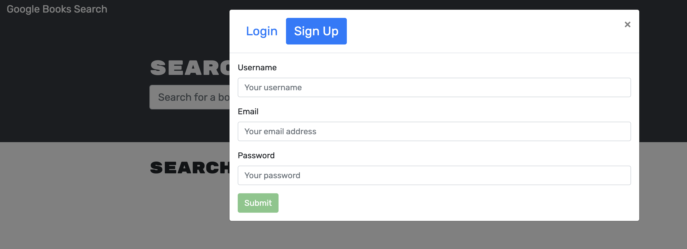
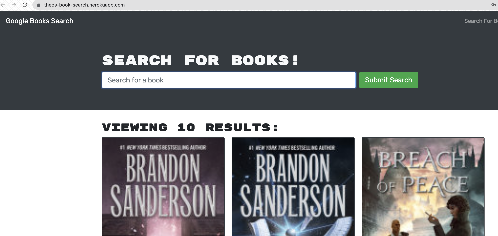
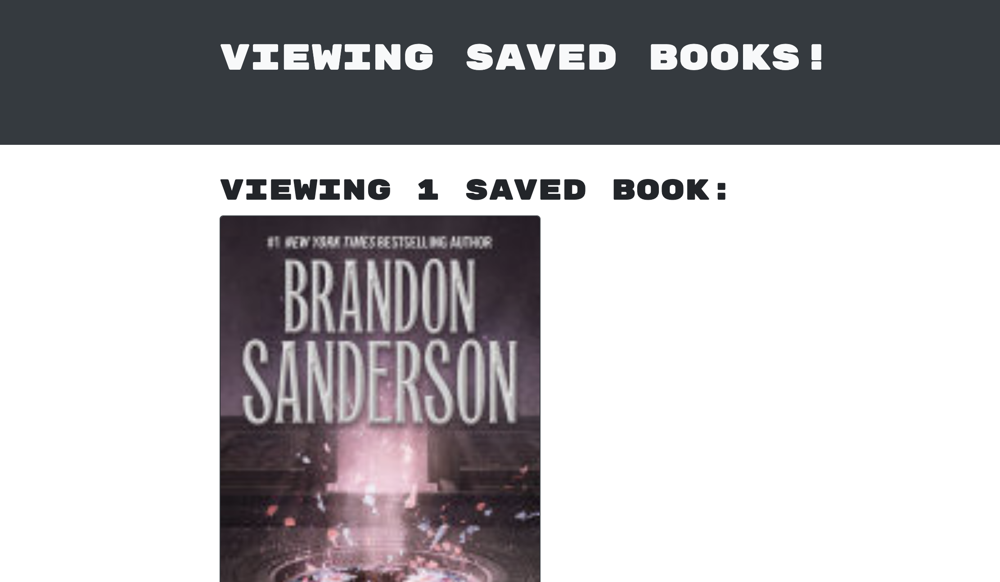

# Theo's Book Search App
## Description

This app lets user's search for books using Google's Books API. You can save books to your list to keep track of books you're interested in, and remove them.
[Visit Here](https://theos-book-search.herokuapp.com/) to start using the application!

## Table of Contents

-[Usage](#usage)  
-[Contributing](#contributing)  
-[Questions](#questions)  
-[License](#license)  

## Usage
To run, do the following:   
Navigate to the deployed application [url](https://theos-book-search.herokuapp.com/).

Usage Images:

  
  
  

## Contributing

Please Fork

## Tests

To test, run the following  

## Questions

For questions please check [my GitHub](https://github.com/Tward9)
or reach out via email at <theoward9@gmail.com>
